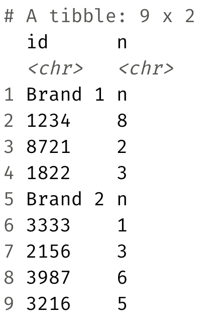

Sales
================
Thomas Sease

``` r
library(tidyverse)
library(readxl)
```

-   Read in the Excel file called `sales.xlsx` from the `data-raw/`
    folder such that it looks like the following.



``` r
data <- read_excel("data-raw/sales.xlsx", skip = 3, 
                   col_names = c("id", "n"))
```

-   **Stretch goal:** Manipulate the sales data such such that it looks
    like the following.


``` r
data <- data %>% 
  mutate(is.brand.name = str_detect(id, "Brand"), 
         brand = if_else(is.brand.name, id, NULL)) %>% 
  fill(brand) %>% 
  filter(!is.brand.name) %>% 
  select(brand, id, n)
```
